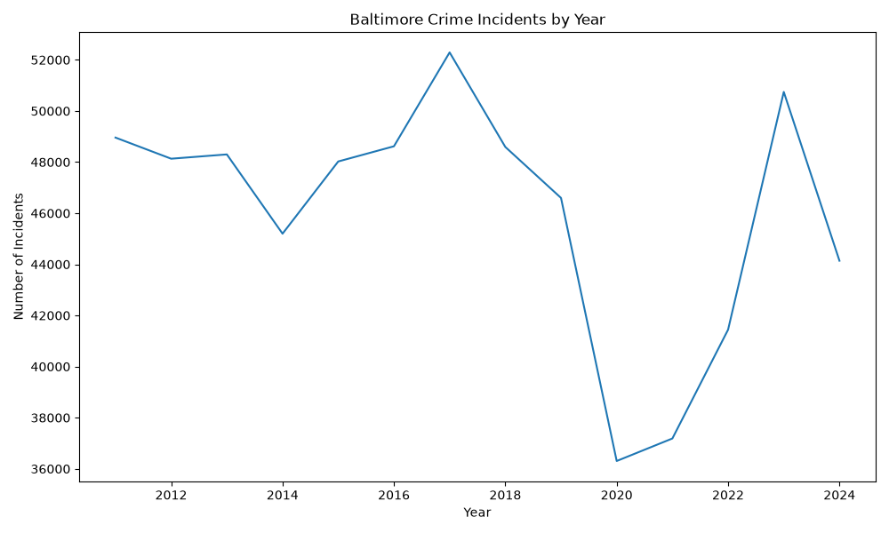
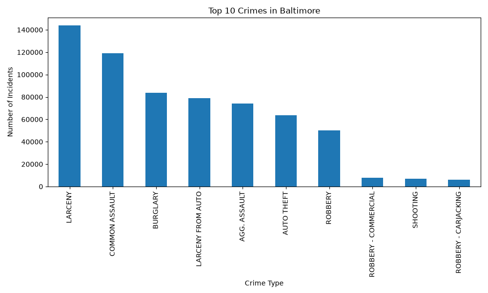
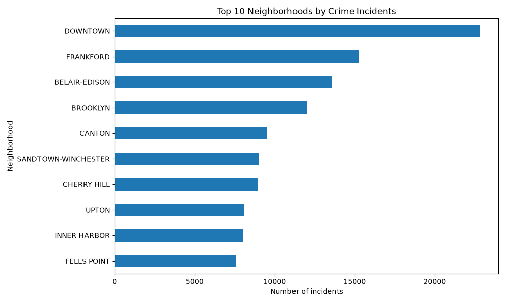
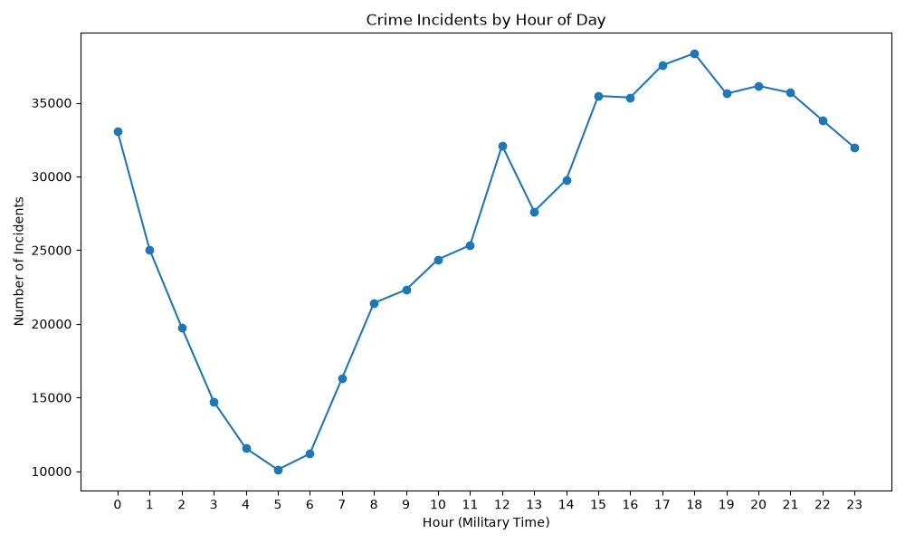

# Baltimore Crime Trends and Geographic Risk Analysis

## Project Overview

This project analyzes over 640,000 crime incidents reported in Baltimore, Maryland. Using Python, Pandas, and Matplotlib, the dataset was cleaned, transformed, and explored to identify crime patterns across neighborhoods, time periods, and offense types.

The goal of this project was to better understand crime trends in Baltimore and communicate insights through data visualization.

## Tools Used

- Python
- Pandas
- Matplotlib
- Git/GitHub

## Dataset

Source: Open Baltimore Data Portal

The dataset contains crime incident records including:
- Crime type
- Date and time
- Neighborhood
- Geographic coordinates
- Demographic information
- Location information
- Weapon Used
- Ethnicity

After cleaning, the dataset contained over 640,000 records for analysis.

## Data Cleaning

When cleaning the data, the following preprocessing steps were performed:

- Removed duplicate records
- Converted CrimeDateTime to datetime format
- Created Year, Month, Day of Week, and Hour features
- Filtered records prior to 2000 due to anomalous date values
- Exported a cleaned dataset for analysis

## Key Findings

Crime Types
From the bar chart, Larceny was the most frequently reported crime with about 140,000 incidents being reported from 2011-2024. Following that, Common Assault and Robbery were the second and third most common reported offenses, having between 80,000 - 120,000 incidents reported. Property crimes accounted for a large proportion of reported incidents.

Neighborhood Trends
Downtown Baltimore had the highest number of reported crime incidents, having over 20,000. Following, Frankford and Belair-Edison had a great value of reported incidents, being around 15,000. Neighborhoods and areas with a high crime rate were those of commercial or entertainment districts. 

Time Trends
Crime usually occurs during the evening hours, with 6pm being a peak hour for incidents to occur. Between 5pm and 9pm were when most crime activity occurred. Early morning hours experienced the least amount of crime activity. 

Yearly Trends
From 2011 to 2025, the crime rate levels fluctuated over time, not following a steady upward or downward trend. In recent years, starting in 2023, there has a been a decrease in crime rate in Baltimore city.

## Visualizations

### Crime Incidents by Year

### Top Crime Types

### Top Neighborhoods

### Crime by Hour

